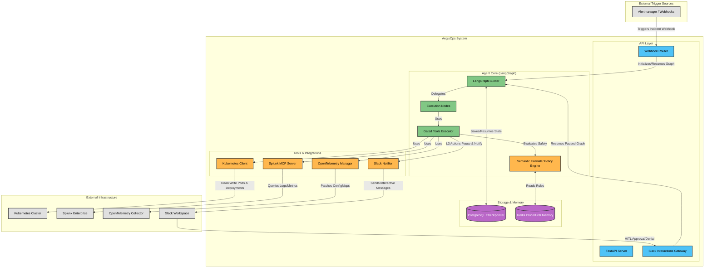

# AegisOps Architecture Details

AegisOps is an autonomous Agentic Site Reliability Engineering (SRE) platform. This document provides a detailed overview of its architecture, core components, and external interactions.

## High-Level Architecture Diagram

## Component Breakdown

### 1. API Layer
- **FastAPI Server (`aegisops.api`)**: The main entry point for the application.
- **Webhook Router**: Receives incoming alerts (e.g., from Prometheus Alertmanager) and initiates the LangGraph execution.
- **Slack Gateway**: A specialized endpoint for receiving interactive callbacks from Slack (e.g., when a human approves or denies a mutating action via Smee).

### 2. Agent Core (LangGraph)
- **Graph Builder (`aegisops.agent.graph_builder`)**: Constructs the stateful execution graph for incident investigation and remediation.
- **Execution Nodes (`aegisops.agent.nodes`)**: Defines the steps the agent takes, such as retrieving logs, analyzing root causes, and formulating a remediation plan.
- **Gated Tools (`aegisops.agent.gated_tools`)**: A wrapper around tool execution that ensures sensitive operations go through the Semantic Firewall.
- **Semantic Firewall**: Evaluates tool calls against predefined safety policies (stored in Redis) to prevent unauthorized or unsafe infrastructure mutations.

### 3. Storage & Memory
- **PostgreSQL**: Used as a checkpointer for LangGraph state management. Allows complex operations to pause (e.g., waiting for human approval) and resume without losing context.
- **Redis**: Acts as the procedural memory store, holding the dynamic safety policies and configuration rules the Semantic Firewall checks against.

### 4. Tools & Integrations
- **Kubernetes Client (`aegisops.integrations.kubernetes`)**: Interacts directly with the K8s API to read cluster state or execute remediations (e.g., restarting a pod).
- **Splunk MCP (`aegisops.mcp.splunk`)**: Integrates with Splunk Enterprise using the Model Context Protocol to fetch diagnostic logs and metrics seamlessly.
- **OpenTelemetry Manager**: Dynamically manages OpenTelemetry Collector configurations, allowing the agent to throttle telemetry during high-volume incidents.
- **Slack Notifier**: Responsible for sending interactive Slack messages to request human-in-the-loop (HITL) approval for Level-3 (mutating) actions.
